# SwedevCo.

## Milestone 3, Python and Data Centric development

[Live website here](https://swedevco.herokuapp.com/)

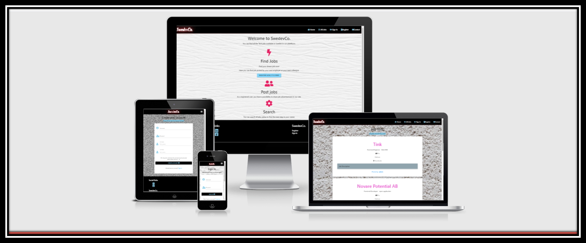

### About the project

SwedevCo is a website dedicated to all employers, companies, even private people who want to post a job advertisement or search for an attractive job in the Infortmation Technology sector on the site. The website allows users to create an account and be able to share, edit and delete posts according to (Create, Read, Update, Delete). The website is created in a responsive design that is very handy to search or post a job from mobile devices to tablets or larger screens.
This website is made to prepare my Milestone Data-centric project with Code Institute.
This web application was made by Flask and MongoDB, the frontend was designed using materialize.

___

# Table of Contents

[Description](#Description)

[User Experience](#User-Experience)

   * [Project goals](#Project-goals)

   * [User Stories](#User-Stories)

   * [Design](#Design)
   
   * [Strategy](#Strategy)

   * [Wireframes](#Wireframes)

   * [Data Schema](#Data-Schema)
     
[Features](#Features)

   * [Potential features](#Potential-features)

   * [Advanced feature](#Advanced-feature)

[Technologies Used](#Technologies-Used)

[Testing](#Testing)

[Deployment](#Deployment)

[Bugs](#Bugs)

[Credits](#Credits)

---

## Description

Swedevco offers a free service to post and share job advertisements from exciting and well-known companies in Sweden.
The search function on the site make it easy for everyone to find jobs in their specialized field.
It was designed for users to post jobs that others may find intresting. 

---

## User Experience

   The ideal users are everybody that want to share or repost job advertisement to job seeker who wants to work in Sweden.

   ### Project goals
       
   * Create a website that uses HTML, CSS, Javascript, Python, Flask and MongoDB.
   * Create a website that is easy to navigate and simple.
   * Create a website that provides users and site owners to post or share a job advertisement.
   * Create a fully responsive site that is compatible with all devices.
   * Create users and site owners to Create, Read, Update and Delete job advertisements.

   ### User Stories

   * User with account: 
         * Navigate easily on the site.
         * Create an account.
         * Post job advertisements from any device.
         * Search or read for jobs posted by other users.
         * Contact the site owner or support.
         * Manage the job advertisement that I posted.
         * Logout from account for security reason. 

   * User without account:
        * Navigate easily on the site.
        * Can search for jobs on the site without registration from any device.
        * Contact site owner or support.

   * User as admin:
        * Navigate easily on the site
        * Post and share job advertisements from any devices.
        * Manage Category.
        * Have access to delete and remove users job advertisements if needed.
        * Manage the job advertisement that I posted..
        * Make sure that the user cannot log in to my profile or have access to the database.
        * Logout from my admin account after visiting the site.

          

   ### Design

   * Colour scheme

      Logo title: #fff;   rgb(223, 14, 14);   rgb(252, 41, 51);   #0c0c0c;   #333;

      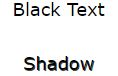  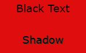  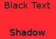  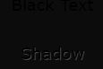  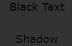

      * Navbar and footer background color: black;

      

      * Tiny and small icons: skyblue;

      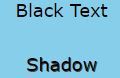

      * Icons for the landing page:  pink lighten-2

      

      * Button: black;

      * Modal delete button: blue lighten-1

      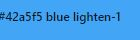

      * Modal cancel button: green lighten-1

      

      * Border for the flash messages: #f51fb8;

      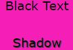

      * Background color on the edit_jobs.html: lightblue;

   * Typography

      * Akronim used to style The logo name. 
      
   * Icons

      * In this project, icons are provided by [Fontawesome](https://fontawesome.com/).

   * Images

      * [Compressor](https://compressor.io/) used to reduce the size of the images without loosing the original quality.

      * Background Images: 

        * index.html: [Pixabay](https://pixabay.com/sv/illustrations/textur-tr%c3%a4-s%c3%a4d-struktur-tr%c3%a4-textur-1027678/)
        * jobs.html:  [Besthqwallpapers](https://besthqwallpapers.com/sv/texturer/gipsstrukturen-texturerat-gips-vit-v%C3%A4gg-konsistens-vit-sten-bakgrund-v%C3%A4gg-83626)
        * contact.html: [Besthqwallpapers](https://besthqwallpapers.com/sv/texturer/4k-vit-brickwall-close-up-vitt-tegel-tegel-texturer-123049)
        * edit_category.html: [Pixabay](https://pixabay.com/sv/photos/vit-m%c3%a5lad-betongv%c3%a4gg-betong-white-888895/)
        * post_jobs.html: [Pixabay](https://pixabay.com/sv/photos/white-v%c3%a4gg-texturer-arkitektur-4298476/)
        * profile.html: [Pixabay](https://pixabay.com/sv/photos/v%c3%a4gg-tegel-baird-2423815/)
        * register.html: [Besthqwallpapers](https://besthqwallpapers.com/sv/texturer/v%C3%A4gg-konsistens-vit-gipsstrukturen-vit-v%C3%A4gg-sten-struktur-81890)
        * signing.html: [Pixabay](https://pixabay.com/sv/illustrations/textur-tr%c3%a4-s%c3%a4d-struktur-tr%c3%a4-textur-1027796/)
       

   * Defensive design

        * Not registered users can not post, share, delete or edit job advertisements.
        * More than 5 characters required for username and password by creating an account.
        * When deleting posts, a modal appears to confirm if you a user want to remove or delete a post.
        * Category must be given.

   ### Strategy

   The aim of the project was to create a simple community jobs board that included full CRUD functionality using Python, Flask, MongoDB, JavaScript, CSS, Materialize and HTML that could be built upon in the future to include more features

   ### Wireframes

   * [Landing page](https://documentcloud.adobe.com/link/review?uri=urn:aaid:scds:US:1a0a4575-1e11-4db5-93ed-e3982e30a3b7)
   * [All Jobs](https://documentcloud.adobe.com/link/review?uri=urn:aaid:scds:US:8b483c04-7bb2-44ef-8ead-03b7aadffc8c)
   * [Sign In](https://documentcloud.adobe.com/link/review?uri=urn:aaid:scds:US:9abe740f-1503-400b-abd8-02fe93ec4c78)
   * [Registration page](https://documentcloud.adobe.com/link/review?uri=urn:aaid:scds:US:d1671473-ddeb-45e7-940c-84b711a6a5d5)
   * [Contact page](https://documentcloud.adobe.com/link/review?uri=urn:aaid:scds:US:b406f85f-acc7-4cd7-a242-871a55f2f7e0)
   * [Profile page](https://documentcloud.adobe.com/link/review?uri=urn:aaid:scds:US:2ff8016c-3798-40c7-b5a8-021059c86630)
   * [Post Jobs page](https://documentcloud.adobe.com/link/review?uri=urn:aaid:scds:US:49aab15b-f859-4adb-9404-a306fda56a1b)
   * [Edit jobs page](https://documentcloud.adobe.com/link/review?uri=urn:aaid:scds:US:d00c5569-0350-482a-b661-1b085dd2dc07)
   * [Add category page](https://documentcloud.adobe.com/link/review?uri=urn:aaid:scds:US:e9c9a793-a92f-4860-9e20-d3bec1aa1452)
   * [Edit category page](https://documentcloud.adobe.com/link/review?uri=urn:aaid:scds:US:40fd2d3f-f5e0-476c-bc96-06cb21043f0c)

   ### Data schema

   * I used [excalidraw](https://excalidraw.com/) to make a Flask application structure.
   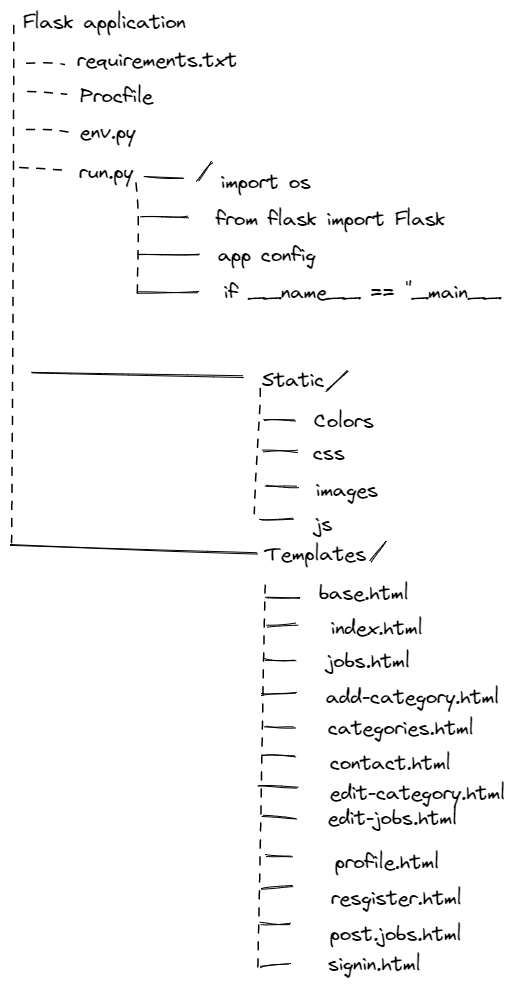

     
   * Database
   1. [MongoDB](https://www.mongodb.com/) is the database service used for this project. 
   1. The project has 3 collections in the database: Categories, Users and Jobs. All fields are string data types.
     [Dbdiagram](https://dbdiagram.io/) used to make a structure for the database.
    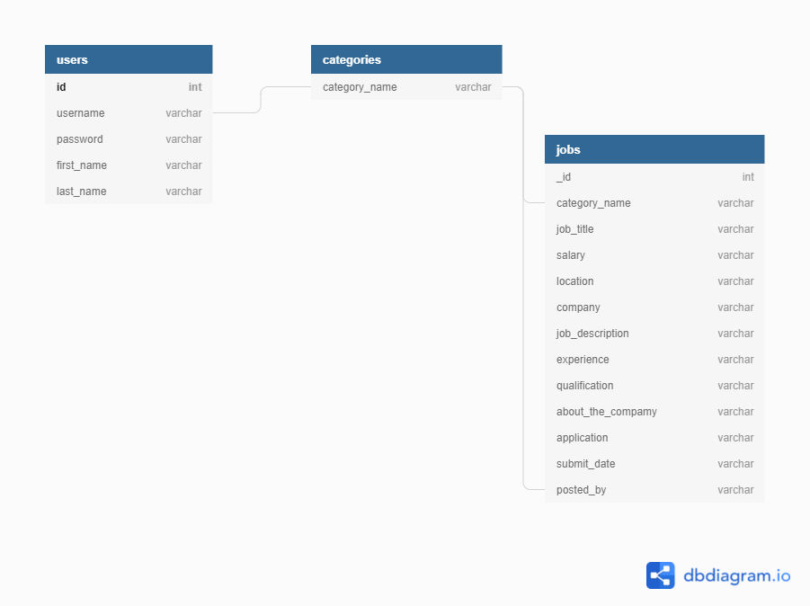

---
[Back to Table of contents](#Table-of-Contents)

## Features
   
   ### Potential features

   #### Structure

   * Responsive and user-friendly interface.
   * Easy navigation menu bar.
   * Simple design.
   * User can create an account.
   * User can sign In.
   * User can edit and delete job advertisements.
   * Menu bar at the top of the page applied on all pages.
   * Footer has been designed at the bottom of the page. 
    
   #### Surface
    
   * I choose a simple colour palette to style the website with light wall background images. 
   * [Materialize](https://materializecss.com/) used to make the website responsively and user friendly. 
   
   1. **Landing page**
   *  Users can read some information about the webpage. A button with a link in the middle of the page leads to the registration page. 

   2. **All Jobs**
   * Users can search jobs in the search engine and read all the technical jobs posted by users on the top of the page.
   * Registered users with an account can delete or edit their job list on the page.

   3. **Sign In**
   * A simple form where users can sign in with a username and password.
   * New users can also create a new account directly from the sign-in page.

   4. **Register**
   * A simple registration form that users can create an account with users username, password, first name and last name.
   * Users who already have an account can sign in directly from the registration page.

   5. **Contact**
   * Users with or without contact can use the contact form. 
   * User can also send files or documents from the form.
   * A verification message will show up to verify if the user is a human. Users can return to the original website by clicking the website link after sending an email.

   6. **Profile**
   * Users can see their username on the top of the page.
   * All job advertisements posted by the user appear under the profile name. 
   * Users can delete or edit the job advertisements. 

   7. **Categories**
   * Only the admin can manage categories.
   * Admin can add, delete and remove categories.

   8. **Flash messages**
   * Messages displayed on the top of the page to confirm after users have been: 
          
      * registered a new account
      * sign in and sign out
      * delete and edit a job advertisement
      * add, delete and edit category(only for admin)

   9. **Error page**

     * Error pages 404 and 505 will be displayed if users by mistake click on a broken or dead link.

  ### Advanced feature

  1. Add pagination.
  1. Email verification.
  1. Sign up to newsletters.
  1. User can save a job adverstisement.
  1. Add cookies to identify when a new user visits the website.
  
---
[Back to Table of contents](#Table-of-Contents)

## Technologies Used
   
   ### Language Used

   * HTML5 : for structure and the content for my project.
   * CSS : provides the style of the HTML5 elements.
   * Javascript : The language that makes the webpage alive.
   * Jquery : used as the JavaScript functionality.
   * Python : provides the backend of the project.

   ### Program Used

   * [Github](https://github.com/) for the version control.
   * [Gitpod](https://gitpod.io/) is used to develop the project.
   * [Git](https://git-scm.com/) used for version control to commit to Git and push to GitHub.
   * [Heroku](https://www.heroku.com/) is the cloud platform to deploying the app.
   * [MongoDb](https://www.mongodb.com/) to store data.
   * [Flask](https://flask.palletsprojects.com/) is the web framework for the app to access MongoDB.
   * [Jinja](https://jinja.palletsprojects.com/) Jinja is used for Python template.
   * [Werkzeug](https://werkzeug.palletsprojects.com/) to generate password-hash and check-hash.
   * [Randomkeygen](https://randomkeygen.com/) used to generate strong password and secure the appplication.
   * [Jquery](http://code.jquery.com) for css library.
   * [Materialize](https://materializecss.com/) used to make the site responsiveness. 
   * [Balsamiq](https://balsamiq.com/) for mockup.
   * [Am I responsive](http://ami.responsivedesign.is/) to test responsiveness. 
   
---
[Back to Table of contents](#Table-of-Contents)

## Testing
 
  Document for testing can be found [here](Testing.md)

---

[Back to Table of contents](#Table-of-Contents)

## Deployment

#### Before deploying to heroku, follow these steps: 

1. **Github**

   * Sign In in Github.
   * Use Code Institute [template](https://github.com/Code-Institute-Org/gitpod-full-template) to create a repository.
   
* To clone this project from Github follow these steps: 
   * In the Clone with HTTP section, copy the clone URL for the repository.
   * Open your favourite terminal (cmd, Powershell, bash, git bash, etc.)
   * Change the current working directory to the location where you want the cloned directory to be made.
   * Type git clone, and then paste the URL you copied in Step 2.
   
   Visit [Github](https://docs.github.com/en/github/creating-cloning-and-archiving-repositories/cloning-a-repository-from-github/cloning-a-repository) for more details.

2. **Gitpod**

   * Sign in to Gitpod.
   * Click your current workspace.
   * 1 Install Flask using command: pip3 install flask
   * Create a python file: touch app.py
   * Create an enviornement to store sensitive data: touch .gitignore. This file should never pe pushed to Github.
   * In the python app we need to: 
      - import os
      - from flask import Flask
      - import env
      - app = Flask(__name__)

      - If __name__ == ”__main__”:
      - App.run(host=os.environ.get(”IP)

   * Install these packages: 
   - Install pip3 flask-pymongo
   - pip 3 install dnspython
   - update the requrements.txt file
   - set up some files that Heroku needs: pip3 freeze –local> requirements.txt
   - Procfile : echo web: python run.py > Procfile

3. **Deploy to Heroku**

   - Log in to your Heroku account
   - Create a new app from your dashboard
   - Create an app name
   - Choose a region
   - Connect with Github 
   - Search your repository name and connect
Go to settings:
   - Click on the Reavel Config Vars
	- Add IP with the value of 0.0.0.0
   - PORT with the value of 5000
   - SECRET_KEY with the password from https://randomkeygen.com/
   - MONGO_DBNAME with the name of your database.
   - Before deploying to heroku we need to push our repository to Github. 
   - Go back to deploy and inactivate ”Enable Automatic Deploys”
   - Click the button ”Deploy branch”
   - Heroku connected successfully with your Github.

---
[Back to Table of contents](#Table-of-Contents)

## Bugs

* Value of the jobs list was *None*

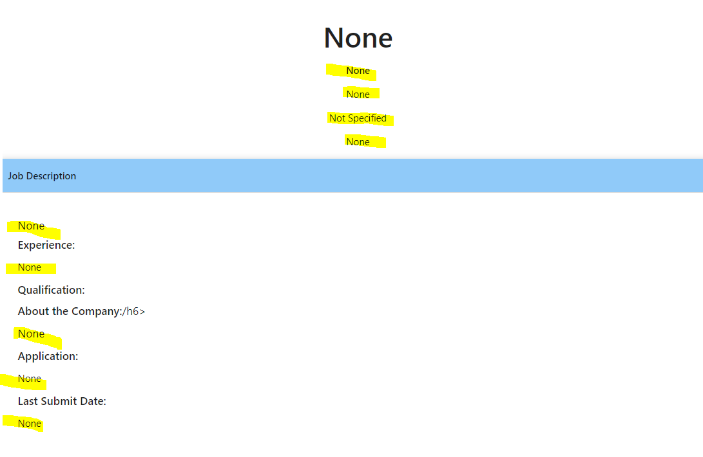

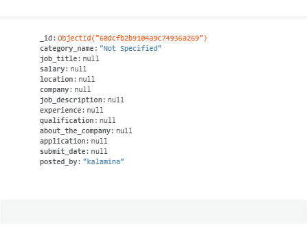

> I solved it by adding a name attribute on the input field.

## Credits

 * Media: 
     
     * Thanks to [Pixabay](https://pixabay.com/) and [Besthqwallpapers](https://besthqwallpapers.com/) for the free downloading of images.

 * Code: 
      
     * A great thanks to Tim Nielsen, Code Institue tutor from the Flask mini-project. Thanks to him, I was able to do this project. He is such a great inspiration. 

     * [Materialize](https://materializecss.com/)library was used to create a responsive design. It is simple and easy to use. 

     * Code snippet for the contact form *send email* by  Ania Kubów from [Youtube](https://www.youtube.com/watch?v=r4RQ38EoLds).

     Template for the contact form was taken from [formsubmit](https://formsubmit.co/).

     * Code snippet from [flask palletsproject](https://flask.palletsprojects.com/en/1.1.x/patterns/errorpages/) to create the error page.

     * All job advertisements was taken from different places. None of them was written by me. 

---

[My Github page](https://github.com/Sojasmine/swedevco)

[My website](http://swedevco.herokuapp.com/)

July © 2021

