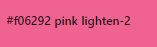
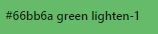

# SwedevCo.

## Milestone 3, Python and Data Centric development

[Lie website here](https://swedevco.herokuapp.com/)
add a screen here

### About the project

SwedevCo is a website dedicated to all employers, companies, even private people who want to post a job advertisement or search for an attractive job in the tech sector on the site. The website allows users to create an account and be able to share, edit and delete posts according to (Create, Read, Update, Delete). The website is created in a responsive design that is very handy to search or post a job from mobile devices to tablets or larger screens.
This website is made to prepare my Milestone Data-centric project with Code Institute.
This web application was made by Flask and MongoDB, the frontend was designed using materialize.

___

# Table of Contents

[Description](#Description)

[User Experience](#User-Experience)

   * [Project goals](#Project-goals)

   * [User Stories](#User-Stories)

   * [Design](#Design)

   * [Strategy](#Strategy)

   * [Wireframes](#Wireframes)

   * [Data Schema](#Data-Schema)
     
[Features](#Features)

   * [Potential features](#Potential-features)

   * [Advanced feature](#Advanced-feature)

[Technologies Used](#Technologies-Used)

[Testing](#Testing)

[Deployment](#Deployment)

[Bugs](#Bugs)

[Credits](#Credits)

[Acknowledgements](#Acknowledgements)

---

## Description

Swedevco offers a free service to post and share job advertisements from exciting and well-known companies in Sweden.
Our Category systems make it easy for everyone to find jobs in their specialized field.
It was designed for users to repost jobs that others may find interesting from other sites, rather than a place to apply for jobs directly.

---

## User Experience

   The ideal users are everybody that want to share or repost job advertisement to job seeker who wants to work in Sweden.

   ### Project goals
       
   * Making a website that uses HTML, CSS, Javascript, Python, Flask and MongoDB.
   * Making a website that is easy to navigate and simple.
   * Making a website that provides users and site owners to post or share a job advertisement.
   * Making a fully responsive site that is compatible with all devices.
   * Allow users and site owners to Create, Read, Update and Delete job advertisements.

   ### User Stories

   * User with account: 
         * Navigate easily on the site.
         * Create an account.
         * Post job advertisements from any device.
         * Search or read for jobs posted by other users.
         * Contact the site owner or support.
         * Manage the job advertisement that I posted.
         * Logout from account for security reason. 

   * User without account:
        * Navigate easily on the site.
        * Can search for jobs on the site without registration from any device.
        * Contact site owner or support.

   * User as admin:
        * Navigate easily on the site.
        * Post and share job advertisements from any device.
        * Manage Category.
        * Have access to delete and remove users job advertisements if needed.
        * Manage the job advertisement that I posted..
        * Make sure that the user cannot log in to my profile or have access to the database.
        * Logout from my admin account after visiting the site.  

   ### Design

   * Colour scheme

         *  Logo title: #fff; rgb(223, 14, 14); rgb(252, 41, 51); #0c0c0c; #333;

                   

         *  Navbar and footer background color: black;

            

         * Tiny and small icons: skyblue;

           

         * Icons for the landing page:  pink lighten-2

           

         * Button: black;

         * Modal delete button: blue lighten-1

           

         * Modal cancel button: green lighten-1

           

         * Border for the flash messages: #f51fb8;

           

   * Typography

      * Akronim used to style The logo name. 
      
   * Icons

      * In this project, icons are provided by [Fontawesome](https://fontawesome.com/).

   * Images

      * [Compressor](https://compressor.io/) used to reduce the size of the images without loosing the original quality.

      * Background Images: 

        * index.html: [Pixabay](https://pixabay.com/sv/illustrations/textur-tr%c3%a4-s%c3%a4d-struktur-tr%c3%a4-textur-1027678/)
        * jobs.html:[Besthqwallpapers](https://besthqwallpapers.com/sv/texturer/gipsstrukturen-texturerat-gips-vit-v%C3%A4gg-konsistens-vit-sten-bakgrund-v%C3%A4gg-83626)
        * add_category.html: [Besthqwallpapers](https://besthqwallpapers.com/sv/texturer/gr%C3%A5-tegel-bakgrund-makro-gr%C3%A5-tegel-gr%C3%A5-brickwall-tegel-texturer-139522)
        * contact.html: [Besthqwallpapers](https://besthqwallpapers.com/sv/texturer/4k-vit-brickwall-close-up-vitt-tegel-tegel-texturer-123049)
        * edit_category.html: [Pixabay](https://pixabay.com/sv/photos/vit-m%c3%a5lad-betongv%c3%a4gg-betong-white-888895/)
        * edit_jobs.html: [Pixabay](https://pixabay.com/sv/photos/v%c3%a4gg-white-abstrakt-tegel-bakgrund-175684/)
        * post_jobs.html:[Pixabay](https://pixabay.com/sv/photos/white-v%c3%a4gg-texturer-arkitektur-4298476/)
        * profile.html:[Pixabay](https://pixabay.com/sv/photos/v%c3%a4gg-tegel-baird-2423815/)
        * register.html:[Besthqwallpapers](https://besthqwallpapers.com/sv/texturer/v%C3%A4gg-konsistens-vit-gipsstrukturen-vit-v%C3%A4gg-sten-struktur-81890)
        * signing.html:[Pixabay](https://pixabay.com/sv/illustrations/textur-tr%c3%a4-s%c3%a4d-struktur-tr%c3%a4-textur-1027796/)
       

         
   
   
   * Defensive design
        * 
[Back to Table of contents](Table-of-Contents)

 
---
## Features

Internet job boards continue to be on the top places to search for job openings.The website lists only technical positions. There is a focus here on all types of technical openings-regular, full time, part time and contract. 
This is a great source for tech job postings. 

1. Strategy
The aim of the project was to create a simple community jobs board that included full CRUD functionality using Python, Flask, MongoDB, JavaScript, CSS, Materialize and HTML that could be built upon in the future to include more features.

* User Goals:
  * Create an account and sign in.
  * Share Tech job.
  * View others posts.
  * Make change .
  * Remove posts.
  * Search among the list.

2. Scope

#### Design
#### Typography
#### Imagery
#### Colour
#### Wireframes
#### Data Schema

Large hero image with someone pointing to their phone to clearly show what the page is for

Text which welcomes the user to their profile page and displays their username

Any jobs that they have posted will be shown here with the most recent being first

A user is able to see the full job they have posted by clicking the more information button - to improve UX and consistency, the job is viewed in the same way as other pages

Edit and delete buttons now show up for users of jobs they have posted

Delete modal pops up if a user wants to delete a job, asking for confirmation that they do actually wish to delete the job

Confirmation message appears on the screen to provide the user with feedback on any action they have taken

##### Edit Job Page

Once the edit button is clicked the user is taken back to the same form for when they posted the job and they are able to update any details they need to

Confirmation message appears on the screen to provide the user with feedback on any action they have taken

#### Sign In Page

Allows the user to sign in to their account

Link to registration page if the user does not already have an account

Confirmation message appears on the screen to provide the user with feedback on any action they have taken

#### Register Page

