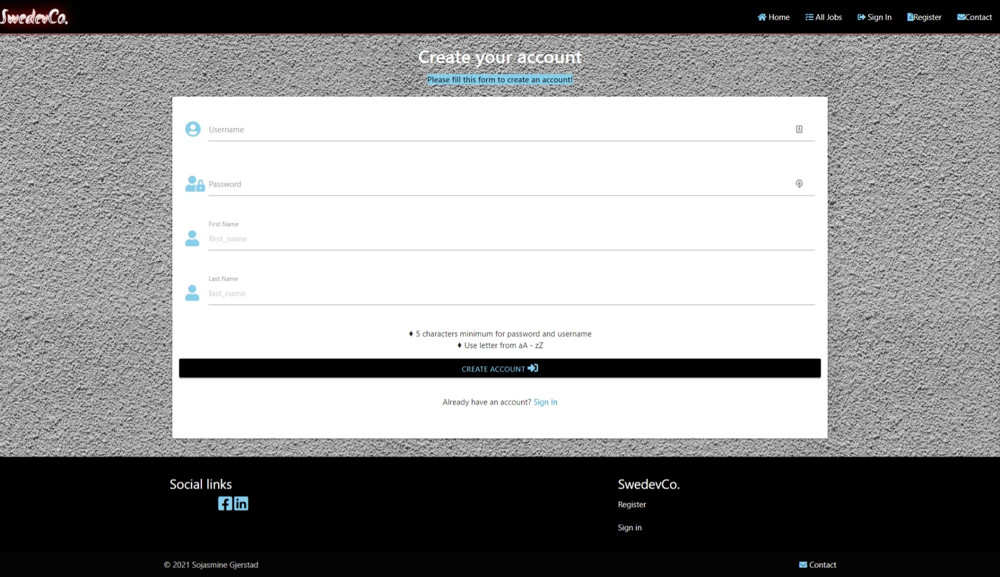
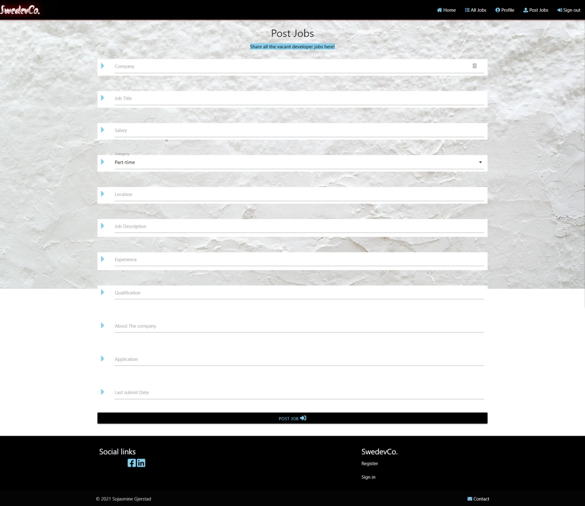
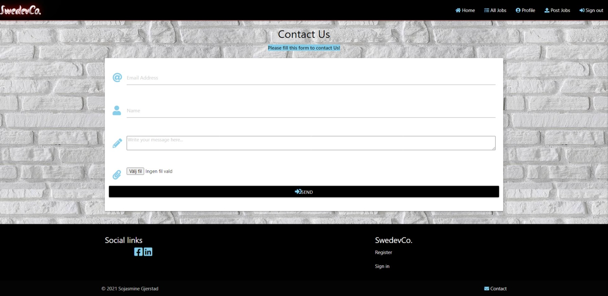
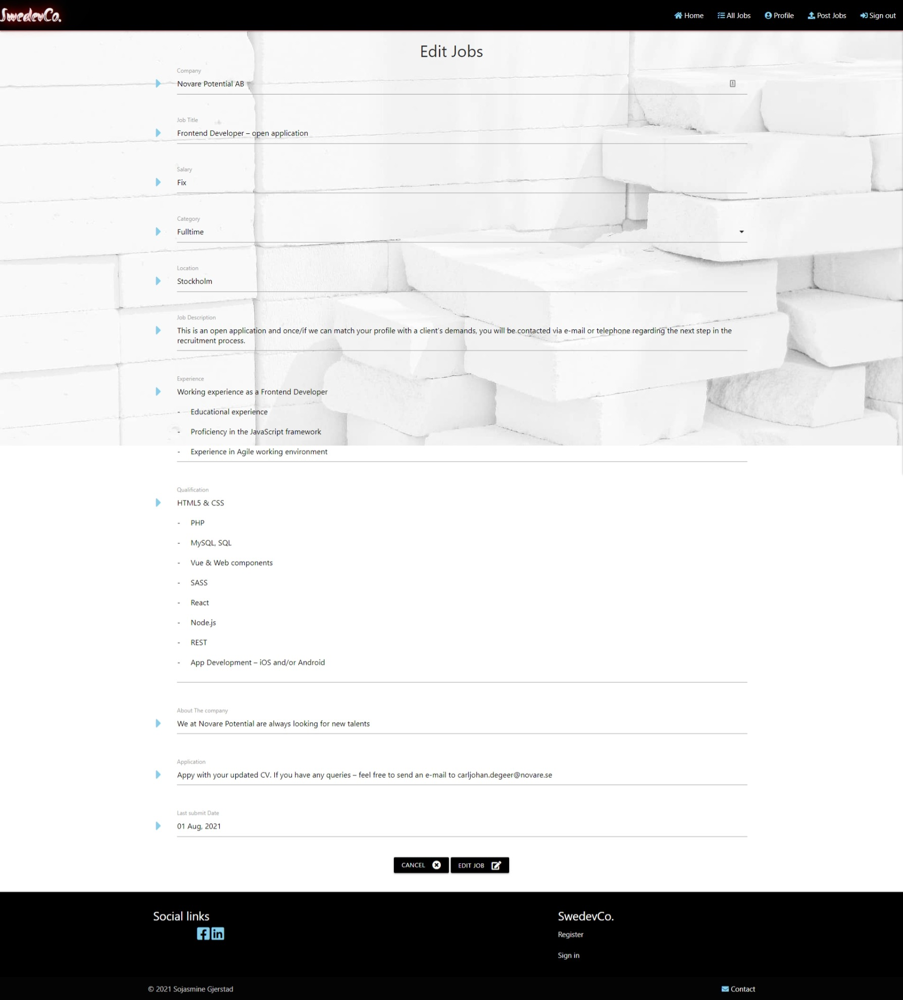
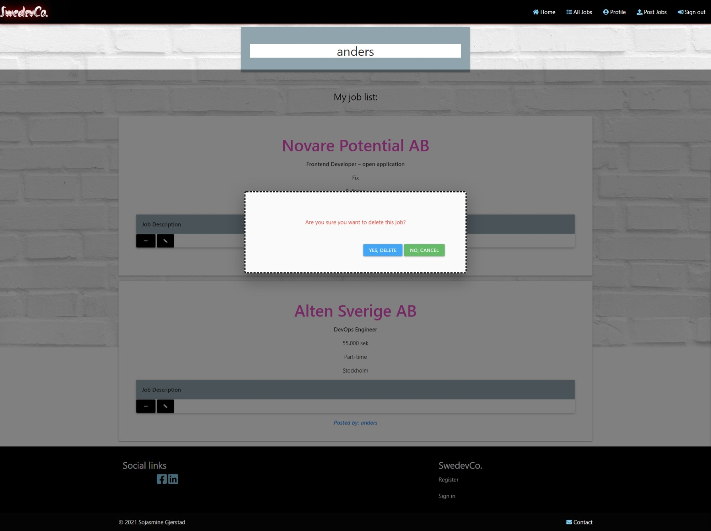
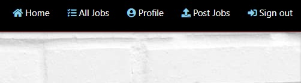
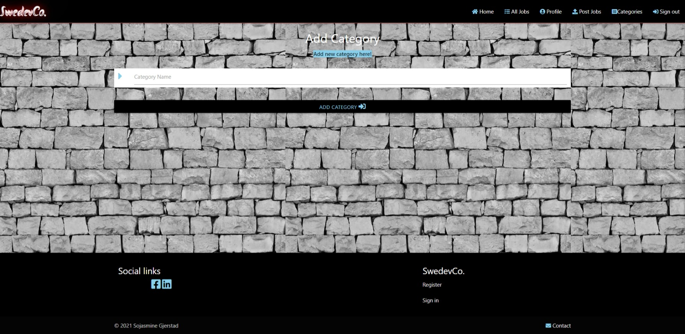
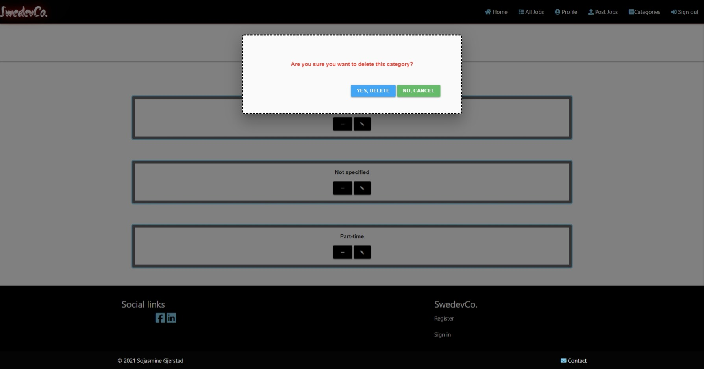
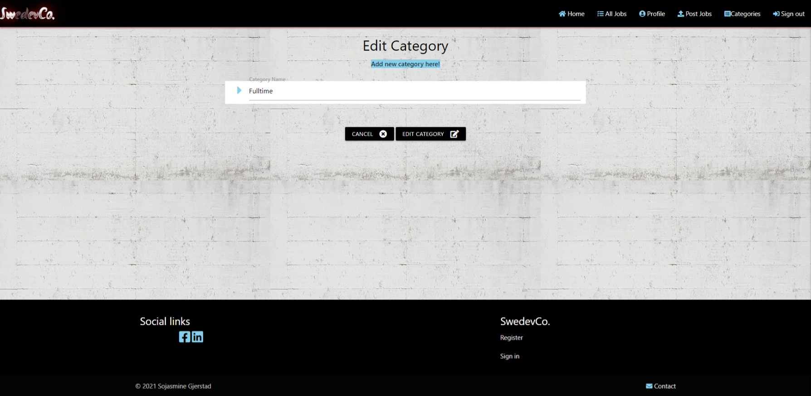

# SwedevCo

## Testing

### Project goals

    
   * Create a website that uses HTML, CSS, Javascript, Python, Flask and MongoDB.
   > All these languages are used to create the website.

   * Create a website that is easy to navigate and simple.
   > Simple navigation bar on the top of the page, easy to read and understand with icons. A short explanation for the user to understand the concept of the website.

   * Create a website that provides users and site owners to post or share a job advertisement.
   > While logged in, users with an account can post a job advertisement.

   * Create a fully responsive site that is compatible with all devices.
   > The website can run on every type of devices.

   * Allow users and site owners to Create, Read, Update and Delete job advertisements.
   > User with account can __Create__ a job advertisement while logged in on *post_jobs.html*.
   > All users can __Read__ all posts and information on the website.
   > User with account can __Update__ posts by editing it on *edit_jobs.html*.
   > User with account can __Delete__ post by removing it from *edit_jobs.html*

### User stories

* User with account: 
    * Navigate easily on the site.
    > User can use the menu bar to navigate.
    

    * Create an account.
    > User can use the simple registration form to create an account.
    

    * Post job advertisements from any device.
    > User can use this form to post a job adverstisements.
    

    * Search or read for jobs posted by other users.
     post it later

    * Contact the site owner or support.
    > User can use this form to get in touch with the site owner or support.
    

    * Manage the job advertisement that I posted.
    > User can make change by editing a post.
    

    > User can remove a post fom the site.
    

    * Logout from account for security reason. 
    > User can log out from the site easily and safely by clicking sign out on the menu bar.
    

    
* User without account:
    * Navigate easily on the site.
    > User can read the information page and all the job advertisements without creating an account.

    * Can search for jobs on the site without registration from any device.
    > post a screenshot later

    * Contact site owner or support.
    > User can contact site owner and support from the contact form as a registred user.

 * User as admin:
    * Navigate easily on the site.
    > Can navigate on the site as a registered and non-registred user.

    * Post and share job advertisements from any device.
    > Can post an advesrtisement as a registred user using the post jobs form.

    * Manage Category.
    > Can add new category.
    

    > Delete category.
    

    > Edit category.
    

    * Have access to delete and remove users job advertisements if needed.
    > As admin and site owner, I can remove anypost in the database.

    * Manage the job advertisement that I posted.
    > Delete a job advertisement.
    > Edit a job advertisement.

    * Make sure that the user cannot log in to my profile or have access to the database.
    > Every user have their username and uniq password.

    * Logout from my admin account after visiting the site.
    > User can log out from the site easily and safely by clicking sign out on the menu bar.

* Javascript
* Python

