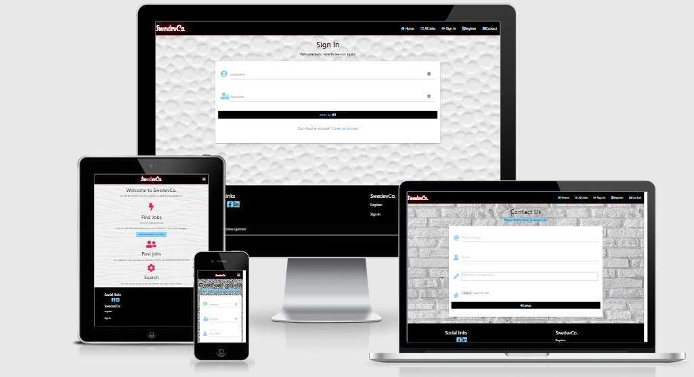
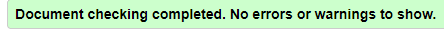
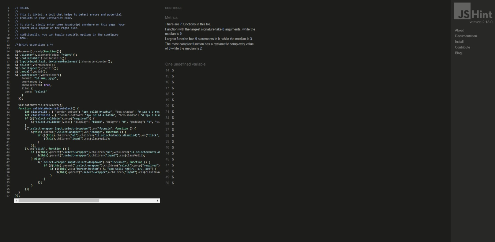
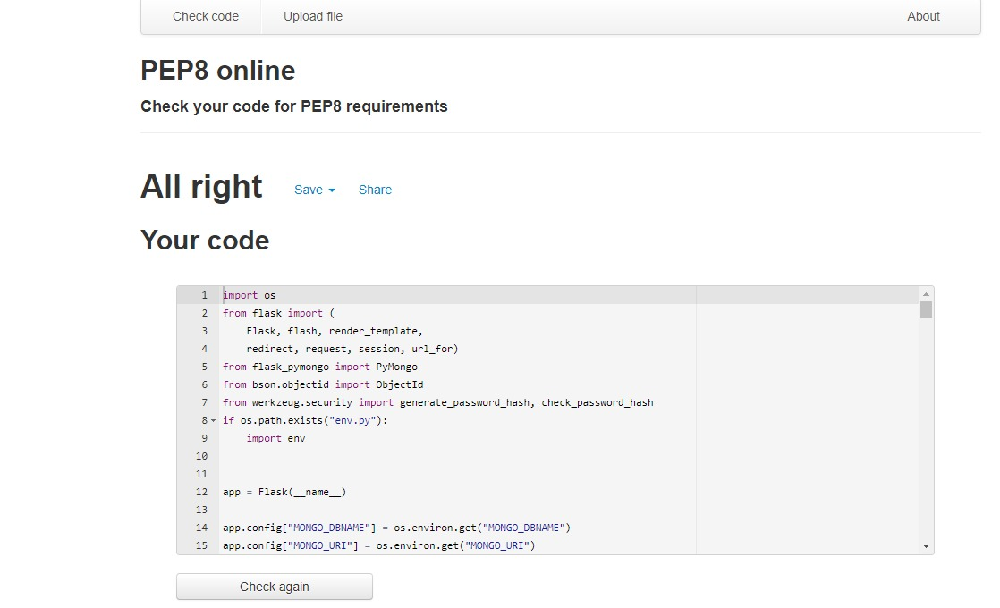

# SwedevCo

## Testing

### Project goals

    
   * Create a website that uses HTML, CSS, Javascript, Python, Flask and MongoDB.
   > All these languages are used to create the website.

   * Create a website that is easy to navigate and simple.
   > Simple navigation bar on the top of the page, easy to read and understand with icons. A short explanation for the user to understand the concept of the website.

   * Create a website that provides users and site owners to post or share a job advertisement.
   > While logged in, users with an account can post a job advertisement.

   * Create a fully responsive site that is compatible with all devices.
   > The website can run on every type of device.

   * Allow users and site owners to Create, Read, Update and Delete job advertisements.
   > User with an account can __Create__ a job advertisement while logged in on *post_jobs.html*.

   > All users can __Read__ all posts and information on the website.

   > User with an account can __Update__ posts by editing it on *edit_jobs.html*.

   > User with an account can __Delete__ post by removing it from *edit_jobs.html*

### User stories

* **User with account** : 
    * Navigate easily on the site.
    > User can use the menu bar to navigate.

    

    * Create an account.
    > User can use the simple registration form to create an account.

    

    * Post job advertisements from any device.
    > User can use this form to post job advertisements.

    

    * Search or read for jobs posted by other users.
     post it later

    * Contact the site owner or support.
    > User can use this form to get in touch with the site owner or support.

    

    * Manage the job advertisement that I posted.
    > Users can make a change by editing a post.

    

    > Users can remove a post fom the site.

    

    * Logout from the account for security reasons.  
    > Users can log out from the site easily and safely by clicking sign out on the menu bar.

    

    
* **User without account** :
    * Navigate easily on the site.
    > User can read the information page and all the job advertisements without creating an account.

    * Can search for jobs on the site without registration from any device.
    > post a screenshot later

    * Contact site owner or support.
    > User can contact the site owner and support from the contact form as a registered user.

 * **User as admin** :
    * Navigate easily on the site.
    > Can navigate on the site as a registered and non-registered user.

    * Post and share job advertisements from any device.
    > Can post an advertisement as a registered user using the post jobs form.

    

    * Manage Category.
    > Can add new category.

    

    > Delete category.

    

    > Edit category.

    

    * Have access to delete and remove users job advertisements if needed.
    > As an admin and site owner, I can remove any post in the database.

    * Manage the job advertisement that I posted.
    > Delete a job advertisement.
    > Edit a job advertisement.

    * Make sure that the user cannot log in to my profile or have access to the database.
    > Every user has their username and unique password.

    * Logout from my admin account after visiting the site.
    > Users can log out from the site easily and safely by clicking sign out on the menu bar

## Functionality testing

* The navigation bar stays fixed on the top of the pages on all devices.
* The footer stays fixed on the bottom of the pages.
* All internal links are tested and working.
* All external links for social media are working.

## Validation

 * [HMTL](https://validator.w3.org/) validate from the direct input.
 
 I had some difficulties validating HTML content because of jinja. I removed everything that is not HTML to run the validation test.

   1. **base.html**
     
  

  > The   was removed from </ul>.

  > A jinja message is supposed to fill the mepty heading.

  > Final result: 
  
  

  
  2. **add.category.html**
  
  

  3. **categories.html**
  
  

  4. **contact.html**

  

  5. **edit_category**

 * [CSS](https://jigsaw.w3.org/css-validator/) validate from the direct input.
   
   

 * [Javascript](https://jshint.com/)
  
   > Result: $ is not defined.
  
  

 * [Python](http://pep8online.com/)
  
   

## Responsiveness

* Responsiveness is tested with [Am I responsive](http://ami.responsivedesign.is/).
* The site was tested by following devices:
   * Motorola
   * Iphone
   * MSI laptop
   * HP laptop

 ## Browser compability

* The site war running by following browser: 
   1. Chrome
   1. Edge
   1. Opera
   1. Firefox

